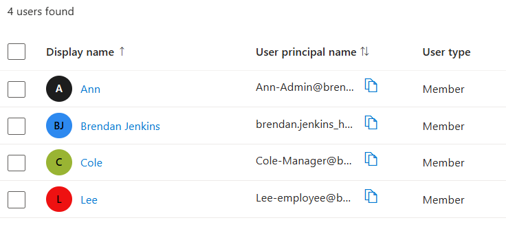

# Azure Windows Server — User Management Lab

## Overview
This lab demonstrates hands-on experience managing user accounts within a Windows Server virtual machine hosted in Microsoft Azure. The objective was to practice basic system administration tasks related to identity and access management.

## Environment
- Microsoft Azure Virtual Machine
- Windows Server 2022 Datacenter
- Remote Desktop Connection

## Tasks Completed
- Connected to cloud-hosted Windows Server VM
- Navigated Computer Management console
- Created local user accounts
- Modified user properties
- Assigned users to groups
- Reviewed account management settings

## Skills Demonstrated
- Windows Server administration fundamentals
- User and group management
- Access control basics
- Remote system management
- Cloud-hosted VM interaction

## Screenshots

### Created User

### User List

### Group Membership

## Key Takeaway
This lab strengthened foundational administrative skills used in IT support and security roles, including identity management and system access configuration within a cloud environment.
